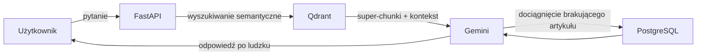

# Proste Fakty

Inteligentna wyszukiwarka i tłumacz polskiego prawa na ludzki język.

---

## Problem

Polskie prawo jest napisane językiem, którego większość obywateli nie rozumie. Setki ustaw, tysiące artykułów, odesłania do innych przepisów — wszystko sformułowane żargonem prawniczym. Ludzie albo rezygnują z szukania odpowiedzi, albo płacą prawnikowi za wyjaśnienie jednego paragrafu.

## Rozwiązanie

Proste Fakty to aplikacja webowa działająca w modelu wyszukaj i przetłumacz (Retrieve & Translate). Użytkownik zadaje pytanie zwykłym językiem, np. *ile wynosi akcyza na e-papierosy?*, a system znajduje odpowiednie artykuły w bazie i wyświetla je jako czytelne karty — przetłumaczone na prosty język.

To nie jest chatbot. Aplikacja nie halucynuje i nie wymyśla odpowiedzi. Każda odpowiedź jest zakotwiczona w konkretnym artykule ustawy, który użytkownik może zweryfikować.

---

## Architektura — Hybrid RAG (Dual-Engine)

System wykorzystuje hybrydowe podejście do RAG (Retrieval-Augmented Generation) z dwoma komplementarnymi silnikami wyszukiwania:



### Szybka ścieżka — baza wektorowa (Qdrant)

Przechowuje super-chunki: główny artykuł wzbogacony o doklejony kontekst artykułów powiązanych. Zapewnia błyskawiczne wyszukiwanie semantyczne — w ok. 90% przypadków dostarcza LLM-owi cały potrzebny kontekst do wygenerowania odpowiedzi w 2-3 sekundy.

- Embeddingi generowane lokalnie przez sentence-transformers
- Indeksowane pola: slug, act_key, article_number
- Każdy chunk zawiera gotowe streszczenie artykułu

### Ścieżka awaryjna — PostgreSQL (Tool / Function Calling)

Przechowuje tysiące surowych, pociętych artykułów z unikalnymi identyfikatorami (slug). Jeśli model wykryje w super-chunku odesłanie do innej ustawy, w ułamku sekundy odpytuje bazę SQL przez Function Calling, dociąga brakujący artykuł i dopiero wtedy generuje odpowiedź.

---

## Moduł Aktualności Prawne — Hot Feed

Strona główna to feed najważniejszych zmian w prawie, stylizowany na portal informacyjny. Karty generowane przez LLM zawierają:

- Tytuł po ludzku
- Zwięzłe streszczenie zmiany
- Kogo dotyczy
- Dlaczego budzi kontrowersje (argumenty za i przeciw)

Dane zasilane z oficjalnego API Sejmu RP — posiedzenia, głosowania i porządki obrad synchronizowane automatycznie.

W planach jest algorytm rankingowy ustalający gorące ustawy na podstawie popularności wyszukiwań i aktywności medialnej.

---

## Model biznesowy

| | Darmowy | Basic (9,99 zł/mc) | Standard (19,99 zł/mc) | Premium (39,99 zł/mc) |
|---|:---:|:---:|:---:|:---:|
| Hot Feed | tak | tak | tak | tak |
| Wyszukiwania / dzień | 10 | 10 | 25 | bez limitu |
| Reklamy | tak | nie | nie | nie |

---

## Stack technologiczny

| Warstwa | Technologie                                                                |
|---|----------------------------------------------------------------------------|
| Backend | Python 3.13, FastAPI, SQLAlchemy (async), LangChain                        |
| AI / LLM | Google Gemini (Function Calling), sentence-transformers                    |
| Bazy danych | PostgreSQL 17, Qdrant (vector store)                                       |
| Pipeline | Automatyczny ETL: .txt -> parsowanie -> PostgreSQL -> embeddingi -> Qdrant |
| Infrastruktura | Docker Compose, uv                                                         |
| Frontend | Next.js, Typescript, SCSS                                                  |

---

## Uruchomienie

### Wymagania
- Docker i Docker Compose
- Opcjonalnie `GEMINI_API_KEY` w pliku `.env` w katalogu głównym

### Start

```bash
# Backend + bazy danych
docker compose up -d --build postgres qdrant backend

# Zasilenie bazy artykułami z plików .txt (jednorazowo)
cd art_raw
pip install sqlalchemy psycopg2-binary
python art_db_creator.py
```

### Dostęp

| Serwis | URL |
|---|---|
| API (Swagger) | http://localhost:8000/docs |
| Health check | http://localhost:8000/health |
| Qdrant Dashboard | http://localhost:6333/dashboard |

### Seed data

`db/seed.sql` zawiera zrzut danych (posiedzenia Sejmu + opisy wygenerowane przez Gemini). Postgres ładuje go automatycznie przy pierwszym starcie (pusty volume).

```bash
./db/dump.sh               # odśwież zrzut z działającej bazy
docker compose down -v     # usuń dane; następne `up` załaduje zrzut od nowa
```

---

## Struktura projektu

```
proste-fakty/
├── backend/
│   └── app/
│       ├── api/              # Endpointy REST (sittings, articles)
│       ├── db/               # Modele SQLAlchemy, sesja, queries
│       ├── pipeline/         # ETL: PDF/TXT -> baza -> wektory
│       ├── schemas/          # Pydantic response models
│       ├── services/         # Logika biznesowa
│       ├── vectorstore/      # Konfiguracja Qdrant + embeddingi
│       └── search.py         # CLI do testowania wyszukiwania
├── art_raw/                  # Surowe teksty ustaw + skrypt ładujący
├── db/                       # SQL seed + dump script
├── frontend/                 # Aplikacja frontendowa (Vite)
└── docker-compose.yml
```

---

## Zespół

Projekt stworzony na HackYeah 2026.
